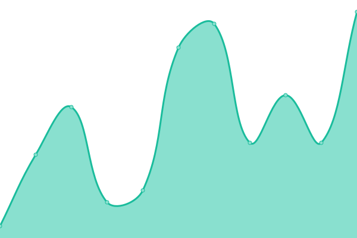
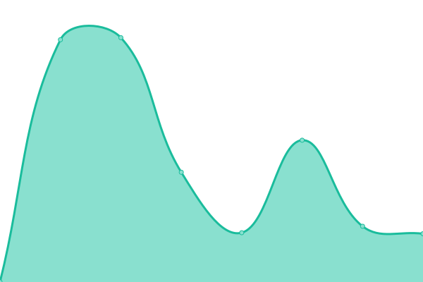

# [📈 Live Status](https://uptime.alphadevs.tech): <!--live status--> **🟧 Partial outage**

This repository contains the open-source uptime monitor and status page for [AlphaDevs](https://uptime.alphadevs.tech), powered by [Upptime](https://github.com/upptime/upptime).

With [Upptime](https://upptime.js.org), you can get your own unlimited and free uptime monitor and status page, powered entirely by a GitHub repository. We use [Issues](https://github.com/thealphadevs/uptimeTrack/issues) as incident reports, [Actions](https://github.com/thealphadevs/uptimeTrack/actions) as uptime monitors, and [Pages](https://uptime.alphadevs.tech) for the status page.

<!--start: status pages-->
<!-- This summary is generated by Upptime (https://github.com/upptime/upptime) -->
<!-- Do not edit this manually, your changes will be overwritten -->
<!-- prettier-ignore -->
| URL | Status | History | Response Time | Uptime |
| --- | ------ | ------- | ------------- | ------ |
|  [AlphaDevs](https://alphadevs.tech) | 🟥 Down | [alpha-devs.yml](https://github.com/thealphadevs/uptimeTrack/commits/HEAD/history/alpha-devs.yml) | 

 0ms
     
 | 

<a href="https://uptime.alphadevs.tech/history/alpha-devs">0.00%</a>
    

|  [wwwAlphaDevs](https://www.alphadevs.tech) | 🟥 Down | [www-alpha-devs.yml](https://github.com/thealphadevs/uptimeTrack/commits/HEAD/history/www-alpha-devs.yml) | 

 0ms
     
 | 

<a href="https://uptime.alphadevs.tech/history/www-alpha-devs">0.00%</a>
    

|  [hack2skill](https://hack2skill.com) | 🟩 Up | [hack2skill.yml](https://github.com/thealphadevs/uptimeTrack/commits/HEAD/history/hack2skill.yml) | 

 1227ms
     
 | 

<a href="https://uptime.alphadevs.tech/history/hack2skill">100.00%</a>
    

|  [www.h2s](https://www.hack2skill.com) | 🟥 Down | [www-h2s.yml](https://github.com/thealphadevs/uptimeTrack/commits/HEAD/history/www-h2s.yml) | 

 0ms
     
 | 

<a href="https://uptime.alphadevs.tech/history/www-h2s">0.00%</a>
    

<!--end: status pages-->

[**Visit our status website →**](https://uptime.alphadevs.tech)

## 📄 License

- Powered by: [Upptime](https://github.com/upptime/upptime)
- Code: [MIT](./LICENSE) © [AlphaDevs](https://uptime.alphadevs.tech)
- Data in the `./history` directory: [Open Database License](https://opendatacommons.org/licenses/odbl/1-0/)
